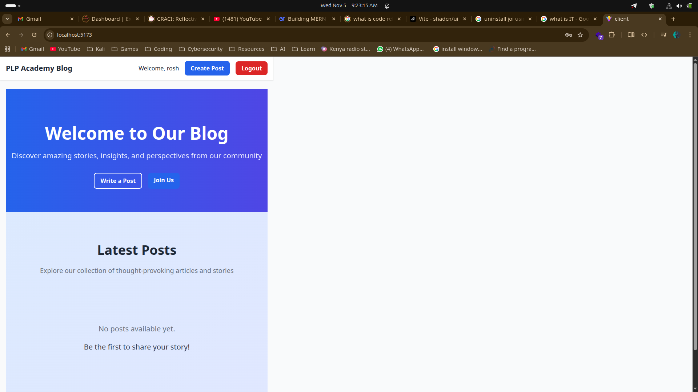
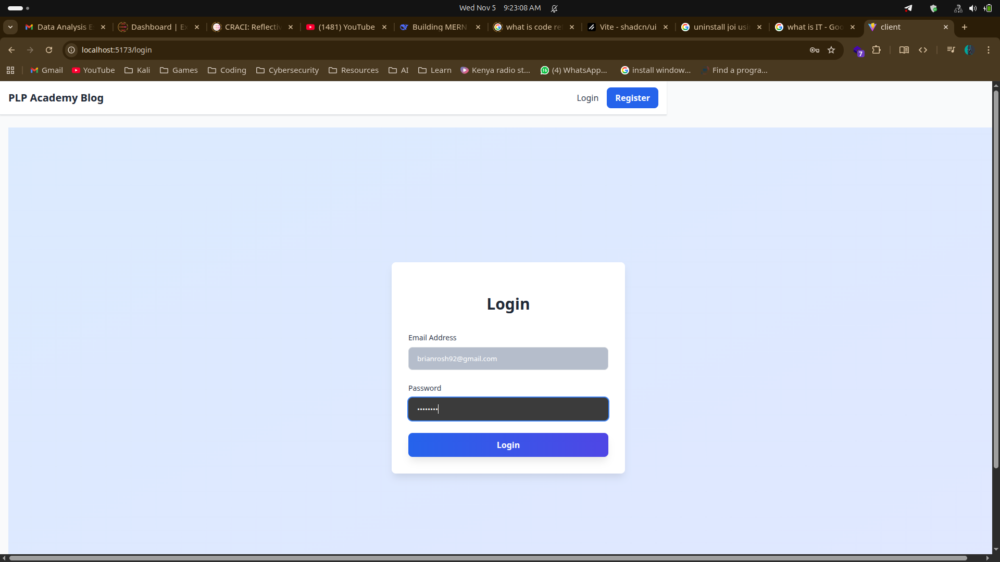

# MERN Stack Blog Application

## Overview

This is a full-stack MERN (MongoDB, Express.js, React.js, Node.js) application that demonstrates seamless integration between front-end and back-end components. The application is a blog platform featuring user authentication, post management, categories, and more.

## Features

- **User Authentication**: Registration, login, and protected routes
- **Post Management**: Create, read, update, and delete blog posts
- **Categories**: Organize posts by categories
- **Responsive UI**: Built with React and styled for mobile and desktop
- **API Integration**: RESTful API with proper validation and error handling
- **State Management**: React hooks and context for efficient data flow
- **Database**: MongoDB with Mongoose for data modeling

## Tech Stack

### Backend
- **Node.js**: JavaScript runtime
- **Express.js**: Web framework for Node.js
- **MongoDB**: NoSQL database
- **Mongoose**: ODM for MongoDB
- **JWT**: JSON Web Tokens for authentication
- **bcryptjs**: Password hashing
- **express-validator**: Input validation

### Frontend
- **React**: UI library
- **Vite**: Build tool and development server
- **React Router**: Client-side routing
- **Axios**: HTTP client for API calls
- **CSS**: Custom styling

## Project Structure

```
mern-stack-integration-krispytank/
├── client/                 # React frontend
│   ├── public/
│   ├── src/
│   │   ├── components/     # Reusable UI components
│   │   ├── context/        # React context for state management
│   │   ├── hooks/          # Custom React hooks
│   │   ├── pages/          # Page components
│   │   ├── services/       # API service functions
│   │   └── ...
│   ├── package.json
│   └── vite.config.js
├── server/                 # Express backend
│   ├── controllers/        # Route handlers
│   ├── middleware/         # Custom middleware
│   ├── models/             # Mongoose models
│   ├── routes/             # API routes
│   ├── server.js           # Main server file
│   └── ...
├── package.json            # Root package.json
└── README.md
```

## Setup Instructions

### Prerequisites
- Node.js (v18+)
- MongoDB (local or cloud instance)
- npm or yarn

### Installation

1. **Clone the repository**:
   ```bash
   git clone https://github.com/PLP-MERN-Stack-Development/mern-stack-integration-krispytank.git
   cd mern-stack-integration-krispytank
   ```

2. **Install server dependencies**:
   ```bash
   cd server
   npm install
   ```

3. **Install client dependencies**:
   ```bash
   cd ../client
   npm install
   ```

4. **Set up environment variables**:
   - Create a `.env` file in the `server` directory with:
     ```
     MONGO_URI=your_mongodb_connection_string
     JWT_SECRET=your_jwt_secret
     PORT=5000
     ```
   - Create a `.env` file in the `client` directory if needed (e.g., for API base URL).

5. **Start the development servers**:
   - **Backend** (from `server` directory):
     ```bash
     npm run dev
     ```
   - **Frontend** (from `client` directory):
     ```bash
     npm run dev
     ```

6. **Access the application**:
   - Frontend: http://localhost:5173 (default Vite port)
   - Backend: http://localhost:5000

## API Documentation

### Authentication Endpoints
- `POST /api/auth/register`: Register a new user
- `POST /api/auth/login`: Login user

### Post Endpoints
- `GET /api/posts`: Get all posts
- `GET /api/posts/:id`: Get a specific post
- `POST /api/posts`: Create a new post (authenticated)
- `PUT /api/posts/:id`: Update a post (authenticated, author only)
- `DELETE /api/posts/:id`: Delete a post (authenticated, author only)

### Category Endpoints
- `GET /api/categories`: Get all categories
- `POST /api/categories`: Create a new category (authenticated, admin?)

## Usage

1. Register a new account or login with existing credentials.
2. Create categories for organizing posts.
3. Create, edit, and delete blog posts.
4. View posts by category or individually.
5. Navigate through the responsive UI.

## Contributing

1. Fork the repository
2. Create a feature branch (`git checkout -b feature/AmazingFeature`)
3. Commit your changes (`git commit -m 'Add some AmazingFeature'`)
4. Push to the branch (`git push origin feature/AmazingFeature`)
5. Open a Pull Request

## License

This project is licensed under the ISC License.

## Acknowledgments

- Built as part of PLP MERN Stack Development course
- Inspired by modern blog platforms

## Images


